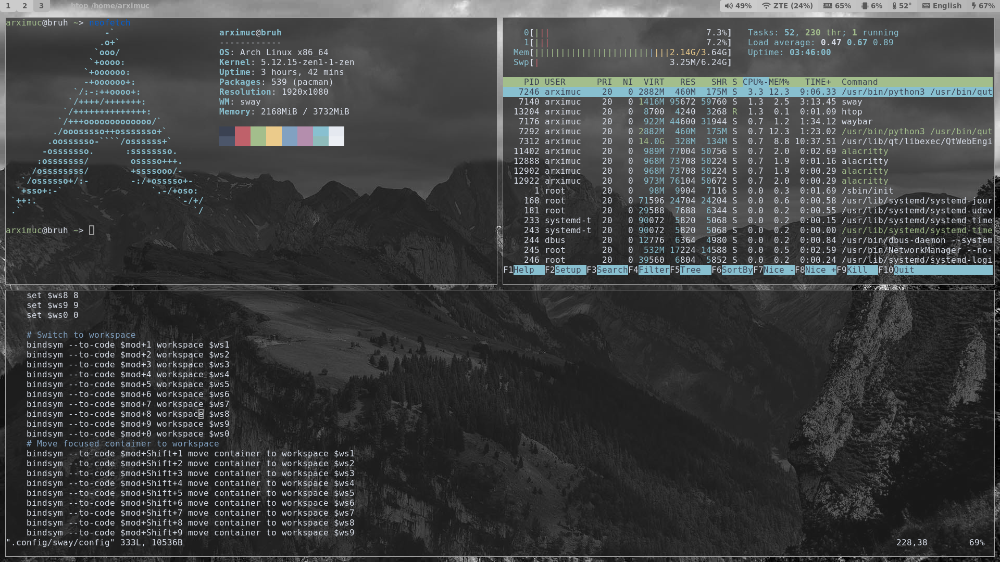

# dotfiles
my configs for sway
### Screenshot

for installing start the **install.sh**
### Dependencies
`sway grim slurp wl-clipboard light alsa-utils mako playerctl alacritty waybar font-dejavu font-awesome5 swaylock swayidle elogind mesa-dri`
